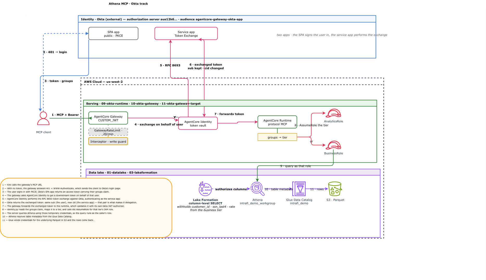

# Athena MCP server on Bedrock AgentCore

This repo hosts a remote Athena MCP server on AgentCore Runtime, and fronts it with an
AgentCore Gateway.

The MCP server is the [AWS Data Processing MCP Server](https://github.com/awslabs/mcp/tree/main/src/aws-dataprocessing-mcp-server)
from AWS Labs, which ships Glue, Athena and EMR tools. You can add your own tools alongside
it — this repo adds four (`whoami`, `list_tables`, `describe_table`, `query_data`).

The Gateway is optional. It gives you a place to apply organisation-level controls in front
of the server: authorization policies, request interceptors for security and governance, rate
limits, and one endpoint over several MCP servers. A single MCP server with no such
requirement can be used on Runtime alone.

The IdP here is Okta. Any OAuth 2.0 / OIDC provider works — AgentCore's inbound authorizer is
provider-agnostic, so Entra ID, Auth0 etc substitute directly.

## What the demo shows

Two groups exist in Okta, `analytics` and `business`, with a user assigned to each. The data
is Parquet in S3, catalogued in Glue as three tables. Business users should not see certain
columns that analytics users can:

| Table | Withheld from `business` |
|---|---|
| `transactions` | `customer_id` |
| `customers` | `customer_id`, `ssn_last4` |
| `deposits` | `customer_id`, `rate` |

Both users run the same query against the same URL and get different columns back:

```
analytics  ->  SELECT * FROM transactions   9 columns, includes customer_id
business   ->  SELECT * FROM transactions   8 columns, customer_id withheld
```

## How that control works

There are two IAM roles, one per group, and they share the same data-access policy — neither
one mentions a column or a table. The difference between them is held in Lake Formation, which
grants each role a different set of columns on the Glue tables. When a user calls a tool, the server reads their group from the Okta JWT and assumes
the matching role. Athena then runs the query as that role, and Lake Formation drops the
columns that role was not granted.

```
1  MCP client calls the gateway's MCP URL with the user's Okta token
2  with no token, the gateway returns 401 + WWW-Authenticate, which starts the browser login
3  the user signs in (PKCE); Okta returns a token carrying their groups claim
4  the gateway asks AgentCore Identity for a downstream token on behalf of that user
5  AgentCore Identity runs the RFC 8693 token exchange against Okta
6  the exchanged token keeps the user in sub and carries the service in cid
7  the gateway forwards it to the runtime, which validates it with its Okta JWT authorizer
8  the server reads the groups claim, maps it to a role, and calls sts:AssumeRole
9  it queries Athena as that role
10 Athena reads table metadata from the Glue Data Catalog
11 Lake Formation filters the columns, Glue vends S3 credentials, rows come back
```

Two consequences worth noting. No column name appears in an IAM policy or in the server code,
so enforcement stays in Lake Formation — a generated query that says `SELECT *` still cannot
return a withheld column. And group resolution fails closed: a user in both groups or in
neither gets `business`.



Editable source: `docs/architecture.drawio`.

---

# Setup

## 1. IdP application and inbound auth

Identity comes first, because the roles, runtime and gateway all reference it.(this demo uses Kiro client/ you can use  your gateway/app)

Two applications are needed, because two parties authenticate at different moments:

| | Type | Represents | Where its client id is used |
|---|---|---|---|
| Login app | SPA, public, PKCE, no secret | the human | the MCP client only — `.kiro/settings/mcp.json`, `scripts/probe_token.py`. Not passed to AWS. |
| Service app | Service, confidential, grants `client_credentials` + `token-exchange` | the agent itself | the AgentCore credential provider, via `OKTA_SERVICE_CLIENT_ID` |

The gateway and runtime authorize on **audience**, not client id, because Okta puts the client
identity in the `cid` claim where `AllowedClients` cannot read it. The exchanged token carries
the user in `sub` and the service in `cid`, which is what makes it delegation rather than
impersonation.

On the Okta authorization server, in this order:

1. Custom authorization server with an audience. The audience is the only value AWS matches
   on, so it has to exist before any AWS authorizer is configured.
2. Scope `api`. Okta's access policies match on requested scopes, so an exchange requesting no
   scope matches no rule and is denied.
3. Groups claim on the **access** token. The runtime reads groups from the access token; on the
   ID token they would not arrive.
4. An access policy rule granting Token Exchange to the service app. Without it the exchange
   fails at Okta with `access_denied`.
5. Groups `analytics` and `business`, with users assigned.
6. Redirect URIs on the login app. Okta's redirect wildcard covers subdomains but not ports,
   so list each one: `:8975` for Kiro, `:8400` for the scripts here.

Then store the service app's client secret in Secrets Manager.

Reference: [inbound JWT authorizer](https://docs.aws.amazon.com/bedrock-agentcore/latest/devguide/inbound-jwt-authorizer.html) ·
[Okta as an AgentCore identity provider](https://docs.aws.amazon.com/bedrock-agentcore/latest/devguide/identity-idp-okta.html) ·
[Microsoft Entra ID](https://docs.aws.amazon.com/bedrock-agentcore/latest/devguide/identity-idp-microsoft.html) ·
[on-behalf-of token exchange](https://docs.aws.amazon.com/bedrock-agentcore/latest/devguide/on-behalf-of-token-exchange.html)

## 2. Roles

`infra/02-roles.yaml` creates one role per group plus two service roles:

- The two tier roles (`${PREFIX}-analytics-role` and `${PREFIX}-business-role`). Both attach
  the same managed policy, `${PREFIX}-tier-data-access`, which grants Athena query, Glue
  catalog read, `lakeformation:GetDataAccess` and write access to the Athena results prefix.
  No column or table name appears in it. The roles differ only in which Bedrock models they
  may invoke, which has no bearing on the data filtering.
- The runtime execution role, which is allowed to assume either tier role.
- The gateway role. This one also needs AgentCore Identity permissions
  (`GetResourceOauth2Token`, `GetWorkloadAccessToken*`, `secretsmanager:GetSecretValue`). If
  they are missing, the gateway target still reports healthy while every tool call fails.

## 3. Data lake and Lake Formation permissions

`infra/01-datalake.yaml` creates the S3 bucket, the Glue database and its three tables, and
the Athena workgroup. `scripts/gen_data.py` and `scripts/upload_data.sh` generate the Parquet
and register the partitions.

`infra/03-lakeformation.yaml` registers the S3 location with Lake Formation and grants
columns per role:

- analytics gets `SELECT` on the whole table, which means every column.
- business gets `SELECT` with `ColumnWildcard.ExcludedColumnNames`.

Exclusion rather than an include list, so a column added to a table later is not handed to the
business tier by default.

`scripts/lf_bootstrap.py` runs before those grants and does two things they depend on:

1. Appends the deploying principal to the Lake Formation administrators, keeping any existing
   admins.
2. Revokes the inherited `IAM_ALLOWED_PRINCIPALS` grant on the database and tables. The
   account default is `IAM_ALLOWED_PRINCIPALS: ALL`; if it is left in place every principal
   sees every column and the column grants have no effect.

`scripts/schema.py` is the single source of truth for tables, columns, partitions and which
columns are restricted. Change a column there rather than in the generator, the templates or
the verifier.

Reference: [data filtering and cell-level security](https://docs.aws.amazon.com/lake-formation/latest/dg/data-filtering.html) ·
[notes on column-level filtering](https://docs.aws.amazon.com/lake-formation/latest/dg/column-filtering-intro.html)

## 4. The MCP server on AgentCore Runtime

`server/` builds a container that runs the AWS Labs Data Processing MCP server over
streamable HTTP on `0.0.0.0:8000/mcp`, which is the contract AgentCore Runtime expects.

The one addition is `server/aws_context.py`, which patches the upstream boto3 client factory
so every AWS call made by an upstream tool runs as the calling user's assumed role. Nothing
is forked, and no tool contains identity logic.

`infra/04-ecr.yaml` and `scripts/build_push.sh` come first, because the runtime references the
image by URI. Build for **ARM64** — AgentCore runs arm64 regardless of your build machine.

`infra/06-runtime.yaml` creates the runtime with a `CustomJWTAuthorizer` pointed at your Okta
discovery URL and audience. It also sets `RequestHeaderAllowlist: [Authorization]`, which is
allowed only because a JWT authorizer is present; under SigV4 that header carries the
gateway's signature and is rejected.

Reference: [deploy MCP servers in AgentCore Runtime](https://docs.aws.amazon.com/bedrock-agentcore/latest/devguide/runtime-mcp.html) ·
[host agents or tools with Runtime](https://docs.aws.amazon.com/bedrock-agentcore/latest/devguide/agents-tools-runtime.html) ·
[AWS Data Processing MCP Server](https://aws.amazon.com/blogs/big-data/accelerating-development-with-the-aws-data-processing-mcp-server-and-agent/)

## 5. The gateway

`infra/07-gateway.yaml` creates the gateway with the same inbound authorizer, and
`infra/08-gateway-target.yaml` attaches the runtime as an `mcpServer` target using `OAUTH` +
`TOKEN_EXCHANGE` outbound auth. The target is last because it needs the runtime's MCP
endpoint, which embeds the runtime's URL-encoded ARN.

The gateway is where organisation-level control over MCP lives:

- **Interceptors.** A Lambda in front of every target. Here `infra/05-interceptor.yaml` blocks
  write and delete tool calls. It deploys before the gateway, which references its ARN.
  `PassRequestHeaders: false` keeps the user's token out of the Lambda.
- **Rate limits.** The native gateway rate limit buckets on `$.context.jwt.sub`, so per-user
  limits need no extra infrastructure.
- **Authorization policies.** The gateway can evaluate Cedar policies per request, in one place
  rather than in each server. Not configured in this repo, but it is where it would go.
- **Token exchange.** The on-behalf-of exchange is a gateway outbound-auth mode. It is what
  carries the end user's identity to the runtime as a token instead of the gateway's own.
- **Consolidation.** For MCP targets the gateway aggregates several servers into one virtual
  MCP server, so clients bind to a single endpoint as the tool estate grows.

If you have one MCP server and need none of the above, Runtime alone is a complete
deployment — it has its own inbound JWT authorizer and clients can connect to its MCP
endpoint directly. Note that without token exchange the tier has to be asserted by something
in front of the server rather than carried in the user's own token.

Reference: [AgentCore Gateway](https://docs.aws.amazon.com/bedrock-agentcore/latest/devguide/gateway.html) ·
[gateway core concepts](https://docs.aws.amazon.com/bedrock-agentcore/latest/devguide/gateway-core-concepts.html) ·
[inbound authorization](https://docs.aws.amazon.com/bedrock-agentcore/latest/devguide/gateway-inbound-auth.html) ·
[outbound authorization](https://docs.aws.amazon.com/bedrock-agentcore/latest/devguide/gateway-outbound-auth.html)

## 6. Using the server from an MCP client

The gateway exposes a standard MCP endpoint, so anything that speaks MCP can use it: a coding
agent such as Kiro or Claude Desktop, an agent framework or SDK, an MCP proxy, or another
gateway. Clients that support the OAuth flow need no token handling — the gateway's 401
challenge starts the browser login.

`scripts/write_kiro_config.py` writes the entry for Kiro into `.kiro/settings/mcp.json`.

---

# Using this repo

## Prerequisites

An AWS account with credentials for a profile, and the Okta setup from step 1 above. Then:

```bash
python3 -m venv .venv && source .venv/bin/activate
pip install boto3 pyarrow cfn-lint

open -a Docker                # macOS. On Linux, `sudo systemctl start docker`
docker info >/dev/null && echo "docker ready"
```

**1. Choose a resource prefix and region.** Every resource name derives from `PREFIX`
(default `mcp`), so a second deployment in the same account only needs a different value.

```bash
export PREFIX="mcp"           # used for role names, bucket, database, runtime, stacks, ...
export AWS_REGION="us-east-1"
```

**2. Point `config.env` at your Okta org.**

```bash
export OKTA_ISSUER="https://<your-org>.okta.com/oauth2/<authorization-server-id>"
export OKTA_SPA_CLIENT_ID="<login-app-client-id>"
export OKTA_SERVICE_CLIENT_ID="<service-app-client-id>"
```

Edit the defaults in `config.env` instead if you prefer.

**3. Store the service app's client secret in Secrets Manager.** Required — `deploy.sh` will
create the AgentCore credential provider from this, and the target stack fails if the secret
is missing.

```bash
aws --region "${AWS_REGION}" secretsmanager create-secret \
  --name "${PREFIX:-mcp}/okta-obo-client-secret" \
  --secret-string '{"client_secret":"<value>"}'

# confirm it landed
aws --region "${AWS_REGION}" secretsmanager describe-secret \
  --secret-id "${PREFIX:-mcp}/okta-obo-client-secret" --query 'Name' --output text
```

**4. Deploy everything.**

```bash
./deploy.sh
```

Steps run in dependency order and the script is idempotent, so re-running converges. To work
step by step:

```bash
./deploy.sh --list            # preflight data roles lakeformation image
                              # interceptor runtime gateway target kiro summary
./deploy.sh --only roles      # one step
./deploy.sh --from image      # resume from a step
```

**5. Confirm the gateway is reachable.** An unauthenticated call should return HTTP 401 with
a `WWW-Authenticate` challenge — that is what makes the browser login start.

```bash
GW_URL=$(jq -r .okta_gateway_mcp_url build/outputs.json)
curl -s -o /dev/null -w '%{http_code}\n' "$GW_URL"   # expect 401
```

**6. Check that the tiers actually differ.**

```bash
python3 scripts/verify_permissions.py
```

This runs the same query as each role through Athena and diffs the columns. It fails if the
two tiers see the same columns, since that means nothing is filtering.

**7. Check the identity chain.**

```bash
python3 scripts/probe_token.py      # browser login, then the token exchange, claim by claim
python3 scripts/smoke_mcp.py --okta # a tool call end to end through the gateway
```

**8. See the difference between tiers.** Same URL, same tool, same SQL, different sign-in:

```bash
python3 scripts/smoke_mcp.py --okta            # sign in as business_user
# sign out of Okta in the browser, then:
python3 scripts/smoke_mcp.py --okta            # sign in as analytics_user
```

The business run returns 8 columns for `transactions`; the analytics run returns 9, including
`customer_id`.

**9. Use it from Kiro.** `deploy.sh` already wrote the entry. Open a chat and ask it to query
the tables; sign in as each user to see the difference.

**10. Tear down when finished.**

```bash
./teardown.sh --dry-run   # show what would be deleted, change nothing
./teardown.sh             # delete, prompting before the destructive parts
```

Stacks are deleted in reverse order. Lake Formation administrators that this demo did not add
are left alone, and account-level Lake Formation default permissions are never modified.

---

## Repo map

Templates are numbered in deploy order and never reference a stack with a higher number.

| `infra/` | |
|---|---|
| `01-datalake.yaml` | S3 bucket, Glue database and three tables, Athena workgroup |
| `02-roles.yaml` | Tier roles, runtime execution role, gateway role |
| `03-lakeformation.yaml` | S3 location registration and per-role column grants |
| `04-ecr.yaml` | Container registry, separate so the image exists before the runtime |
| `05-interceptor.yaml` | Lambda interceptor. Blocks write and delete tool calls. |
| `06-runtime.yaml` | AgentCore Runtime with the Okta JWT authorizer |
| `07-gateway.yaml` | AgentCore Gateway, Okta inbound, native rate limit |
| `08-gateway-target.yaml` | The runtime as an MCP target, plus the OAuth2 credential provider |

| `server/` | |
|---|---|
| `athena_mcp_server.py` | Hosts the AWS Labs server on `:8000/mcp` plus four demo tools |
| `identity.py` | Okta group to role, then `sts:AssumeRole`. Fails closed. |
| `aws_context.py` | Patches the boto3 client factory so calls run as the caller's role |
| `config.py` | Loads settings at startup and reports every missing variable at once |

| `scripts/` | |
|---|---|
| `lib.sh` | Shared bash helpers, sourced first by every script |
| `schema.py` | Source of truth for tables, columns, partitions and restricted columns |
| `gen_data.py`, `upload_data.sh`, `register_partitions.py` | Parquet, S3 sync, Glue partitions |
| `lf_bootstrap.py` | Lake Formation admin and the `IAM_ALLOWED_PRINCIPALS` revoke |
| `build_push.sh` | Builds the ARM64 image and pushes it to ECR |
| `verify_permissions.py` | Per-tier column diff through Athena |
| `probe_token.py` | PKCE login and the token exchange, with both tokens' claims |
| `smoke_mcp.py` | Calls the MCP server end to end |
| `write_kiro_config.py` | Adds the server to `.kiro/settings/mcp.json` |

`config.env` holds every shared name as `${VAR:-default}` · `profiles/` name overrides for a
second deployment · `docs/` diagram · `build/` generated, gitignored

State passes between scripts through `build/outputs.json`, never through environment
variables, so any script can run on its own as long as the earlier ones have written the keys
it needs.

There is no unit test suite. Verification is the three scripts above.

Logging needs no setup; the execution role carries it and AgentCore creates the log group.
Tracing is not configured — no OTEL instrumentation and no CloudWatch Transaction Search.

### A second, differently named deployment

Every name derives from `PREFIX`, so a second deployment in the same account only needs a
different value:

```bash
PREFIX=acme ./deploy.sh --from runtime --skip kiro
```

That adds one runtime, one gateway, one target and one credential provider, reusing the data
lake, roles and image. `profiles/acme.env` is an example of overriding individual names when
you want more control than a single prefix gives. If a credential provider already exists
outside CloudFormation, set `OKTA_OBO_PROVIDER_MODE=adopt` or the stack fails on the
duplicate name.

## When to use this vs the AWS MCP Server in the Agent Toolkit

The [AWS MCP Server](https://docs.aws.amazon.com/agent-toolkit/latest/userguide/mcp-server.html)
in the [Agent Toolkit for AWS](https://docs.aws.amazon.com/agent-toolkit/latest/userguide/what-is-agent-toolkit.html)
is a managed MCP server that gives an agent authenticated access to AWS. Documentation search
and service information need no authentication; AWS API calls, sandboxed Python scripts and
curated skills run under the caller's existing IAM role.

*Purpose*: General-purpose AWS access for an agent. Not an Athena server — the same endpoint reaches any AWS API the user's role permits.

*Auth flow for Athena Query*: Entra group → Identity Center permission set → IAM role → Lake Formation grant. The tier is fixed at login by which role the user federates into.

*Prerequisites*: Entra federated into IAM Identity Center (SAML + SCIM), an AWS identity for every user, one permission set per tier created up front.

*Scope and blast radius*: All 15,000+ AWS APIs sit behind a single tool that executes Python. IAM and Lake Formation control what succeeds, not what the agent attempts — so if the tier role carries any permission beyond Athena, the agent can use it. Content in a table comment or data value could steer it toward an unrelated API call.

CloudTrail logs the call as 'CallTool' with a Python payload rather than "user X ran query Y," so attribution means parsing script bodies. Request params and response content are recorded verbatim, so SQL touching sensitive columns and result snippets land in CloudTrail.

*Quotas*: 10 requests/sec per account per Region, not adjustable. 180 concurrent sessions per account, 90 per user. us-east-1 and eu-central-1 only. No FIPS endpoints.

Go with this option if Entra is already federated into Identity Center, two or three tiers cover your needs, and load is modest.

Go with the repo option if Entra isn't federated into Identity Center yet, users must not have AWS identities, you expect sustained load above roughly 10 requests per second, the agent needs to be restricted to specific queries rather than just specific permissions, you have many tiers or entitlements that are attribute combinations like EMEA + rates desk, or you have region or FIPS requirements.